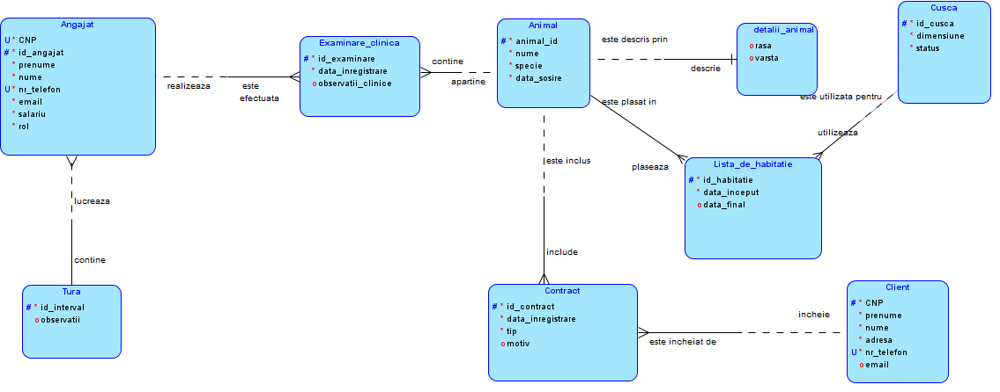
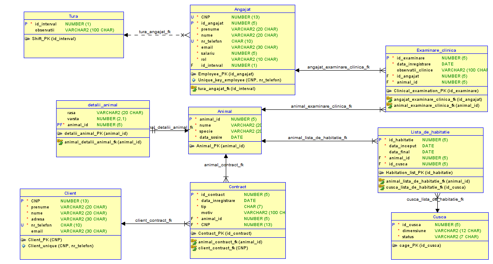

# Database-for-managing-an-animal-shelter
Animalele sunt cazate în adăpost după preluarea acestora de la clienți sau din surse 
necunoscute și pot rămâne o perioadă nelimitată în adăpost. Procedeul de cazare conține 
efectuarea unei examinări clinice și mutarea animalului într-o cuscă. De asemenea, 
pentru fiecare adopție/donație se realizează un contract ce conține datele animalului și 
ale clientului, precum și motivul, în caz de donație. Se rețin contractele în baza de date 
pentru a putea ține evidența interacțiunilor dintre animale și clienți. 
Angajații constituie un aspect important din procesul gestionării unui adăpost. Aceștia 
au, la un moment dat, un singur rol în cadrul instituției( în funcție de profesie, angajații 
interacționează cu animale, clienți sau cu alți angajați), iar în cadrul modelului curent, 
veterinarul are atribuția specială de a conduce examinări clinice și de a crea fișe cu 
informațiile acestora ). Nu se iau in considerare toate tipurile de angajati dintr-un 
adapost(serviciu clienți , HR , personal responsabil cu curatenia,etc) si nu se retine 
ierarhia angajatilor( ce subordonati are fiecare manager). De asemenea, reținem când 
lucrează fiecare angajat prin intermediul turelor (un angajat poate lucra o singură tură 
pe zi). Se consideră că toate turele au durata de 8 ore și nu se reține istoricul lor (doar 
în interval de 24 de ore). Nu se reține ingrijitorul pentru fiecare animal (dacă se dorește 
se poate adaugă în câmpul observații din cadrul turei) și nici istoricul angajaților sau al 
datelor de angajare. 
Prin intermediul listelor de habitație putem afla în ce cușcă este plasat fiecare animal, 
precum și perioada în care cușca este ocupată. Pentru fiecare animal se reține, de 
asemenea, istoricul tratamentelor și veterinarul care le-a efectuat. 
Proiectul nu tratează problema inventarului unui adăpost și nu are în vedere reținerea 
prescripțiilor eliberate de către veterinari. De asemenea, toate numerele de telefon sunt 
considerate cu prefix +4 și nu se sție cât timp este păstrat istoricul adăpostului sau care 
este vârsta maximă a unui animal( se consideră  in model maximul de 99). 

#Diagrama_logica

#Diagrama_relationala

